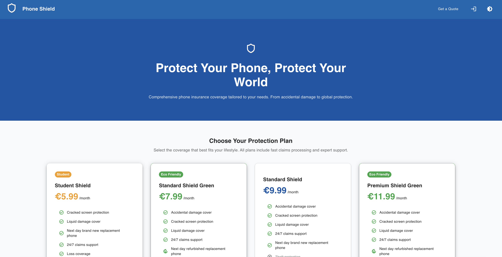
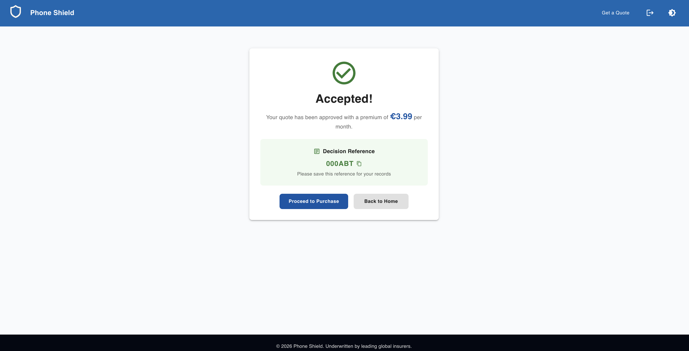
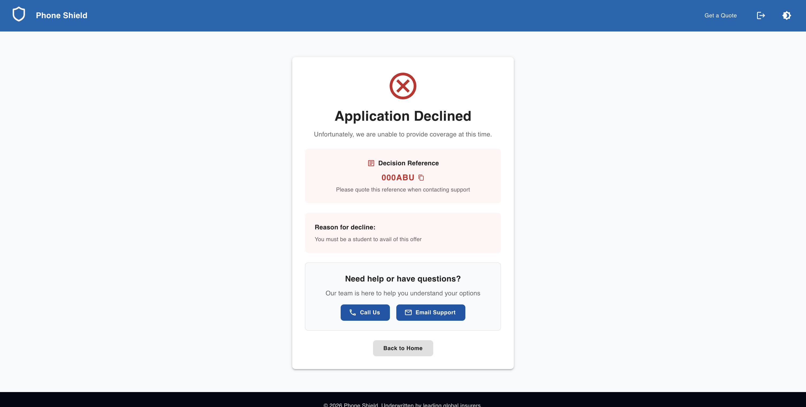
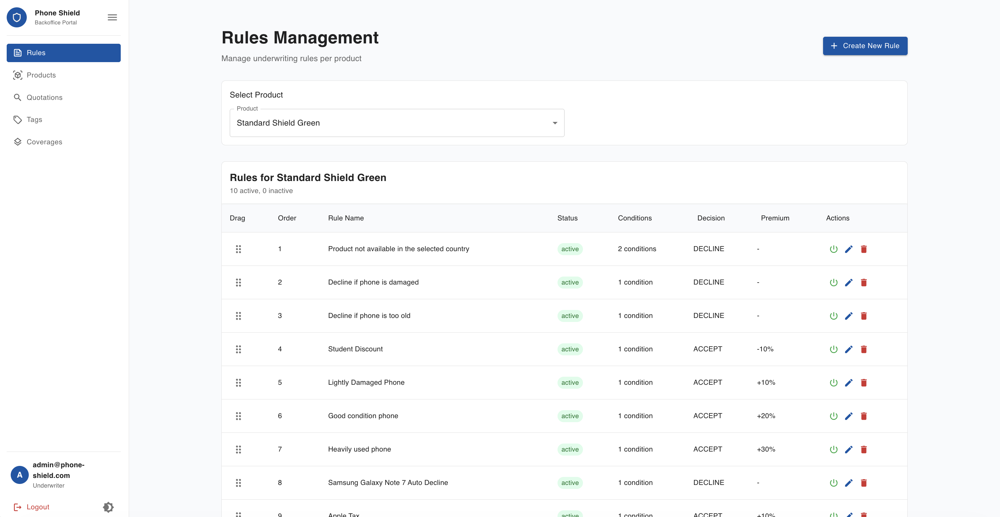
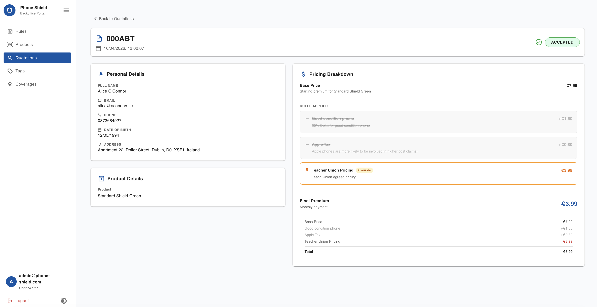
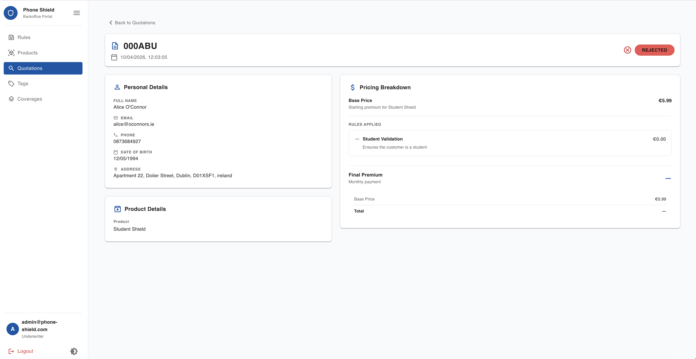

# Project Streamline

Project Streamline is an end to end decisioning service for a simplified insurance product, delivering automated accept/decline/refer outcomes from applicant data along with a calculated premium and a unique decision reference. It includes a secure decisioning API, a rules component to evaluate configurable business logic for decisions and pricing, a simple web quote simulator to demonstrate real time decisions, and a database for managing rules and recording auditable decision transactions. The project emphasises a production ready engineering workflow with automated CI/CD and comprehensive testing.

Built as a Software Engineering Project (Trinity College Dublin, SwEng 2026 — Group 4) in collaboration with an industry partner, with an emphasis on a production-ready engineering workflow: automated CI/CD and comprehensive testing.

> **Note on internal links.** This project was developed on Trinity College's internal GitLab. Links to project boards, issues, CI pipelines, and test reports are preserved below for completeness but require Trinity VPN access. The full source and commit history are in this repository.

## Tech Stack

| Layer | Technology |
| --- | --- |
| Backend | Java 21, Spring Boot 3.5 (Web, Data JPA, Security, Validation) |
| Database | PostgreSQL, with Flyway migrations |
| Auth | Firebase Authentication |
| Frontend | React 19, TypeScript, Vite, Material UI, React Router, Axios |
| Build / Run | Maven, Docker & Docker Compose |
| CI/CD | GitLab CI, Google Cloud Build (deployed to Google Cloud) |

## Screenshots


**Figure 1** Customer Portal.


**Figure 2** Accepted quotation on customer portal.


**Figure 3** Declined quotation on customer portal.


**Figure 4** Rule management on backoffice portal.


**Figure 5** Breakdown of rules applied and quotation calculation on an accepted quotation on backoffice portal.


**Figure 6** Breakdown of rules applied and quotation calculation on an rejected quotation on backoffice portal.

## Build and Run

### Local

#### Backend

1. Change directory to backend

   ```
   cd backend/
   ```

2. Run docker compose to set up application and database

   ```
   docker compose up
   ```

#### Frontend

1. Change directory to frontend

   ```
   cd frontend/
   ```

2. Install frontend dependencies

   ```
   npm i
   ```

3. Set up enviromental variables as per variables in CICD found [here](https://gitlab.scss.tcd.ie/sweng26-group4/project-streamline/-/settings/ci_cd#js-cicd-variables-settings).

4. Run development version of application

   ```
   npm run dev
   ```

5. Open application [here](http://localhost:5173/)

### Cloud

The application is running on the cloud in two enviroments. Both have since been decommissioned.

- [Software Integration Testing](https://sit.phone-shield.com/)
- [Production](https://phone-shield.com/)

## Demos

### Promo

[](https://www.youtube.com/watch?v=VpZ2mztLD0w)

### Technical, Management, and Green Computing

[](https://www.youtube.com/watch?v=eAPUDXRo9pg)

## Tests

- Tests can be found in the frontend [here](frontend/src/test).
- Tests can be found in the backend [here](backend/src/test/java/com/munichre/streamline).
- A test report of our 737 tests can be found [here](https://gitlab.scss.tcd.ie/sweng26-group4/project-streamline/-/pipelines/37249/test_report) (VPN required).
- Code Coverage was tracked [here](https://gitlab.scss.tcd.ie/sweng26-group4/project-streamline/-/graphs/dev/charts) (VPN required)
- Command to run and test the application can be seen in the below table.

| Directory | Command               | Description                                                                                                                            |
| --------- | --------------------- | -------------------------------------------------------------------------------------------------------------------------------------- |
| frontend  | npm run format:check  | Checks the formatting of the frontend code                                                                                             |
| frontend  | npm run format        | Formats the frontend code to the required spec                                                                                         |
| frontend  | npm run lint          | Lints the frontend code, you need to resolve any listing errors                                                                        |
| frontend  | npm run lint:fix      | Attemps to fix simple linting errors                                                                                                   |
| frontend  | npm run test          | Tests the frontend code                                                                                                                |
| frontend  | npm run test:coverage | Generate coverage report for frontend code, you can view this in frontend/coverage, there is a html version for visual viewing         |
| backend   | mvn spotless:check    | Checks the formatting of the backend code                                                                                              |
| backend   | mvn spotless:apply    | Formats the backend code to the required spec                                                                                          |
| backend   | mvn checkstyle:check  | Lints the backend code, you need to resolve any listing errors                                                                         |
| backend   | mvn test              | Tests the backend code                                                                                                                 |
| backend   | mvn verify            | Generate coverage report for backend code, you can view this in backend/target/site/jacoco, there is a html version for visual viewing |

## Project Management

> All links below require Trinity VPN access.

- Development was tracked on our [Development Board](https://gitlab.scss.tcd.ie/sweng26-group4/project-streamline/-/boards/1276?label_name[]=dev).
- Sprints were tracked on our [Sprints Board](https://gitlab.scss.tcd.ie/sweng26-group4/project-streamline/-/boards/1369?label_name[]=dev).
- Submissions were tracked on our [Submission Board](https://gitlab.scss.tcd.ie/sweng26-group4/project-streamline/-/boards/1364?label_name[]=type%3A%3Asubmission).
- Workload across the team was tracked on our [Workload Board](https://gitlab.scss.tcd.ie/sweng26-group4/project-streamline/-/boards/1366).

## Other Notes on Project

- [User Stories](https://gitlab.scss.tcd.ie/sweng26-group4/project-streamline/-/issues?sort=created_date&state=all&label_name%5B%5D=type%3A%3Astory&first_page_size=100) were created in the [Project Streamline](https://gitlab.scss.tcd.ie/sweng26-group4/project-streamline) repository.
- [Implementation Issues](https://gitlab.scss.tcd.ie/sweng26-group4/project-streamline/-/issues?sort=updated_desc&state=all&label_name%5B%5D=dev&not%5Blabel_name%5D%5B%5D=type%3A%3Astory&first_page_size=100) were created in the [Project Streamline](https://gitlab.scss.tcd.ie/sweng26-group4/project-streamline) repository.
- [Epics](https://gitlab.scss.tcd.ie/groups/sweng26-group4/-/epics?sort=created_date&state=all&first_page_size=100) and [Sprints](https://gitlab.scss.tcd.ie/groups/sweng26-group4/-/milestones?sort=due_date_desc&state=all) were created in the [SwEng26 Group4](https://gitlab.scss.tcd.ie/sweng26-group4) group.
- [Tags](https://gitlab.scss.tcd.ie/sweng26-group4/project-streamline/-/tags) were created in the [Project Streamline](https://gitlab.scss.tcd.ie/sweng26-group4/project-streamline) repository.
- [Releases](https://gitlab.scss.tcd.ie/sweng26-group4/project-streamline/-/releases) were created in the [Project Streamline](https://gitlab.scss.tcd.ie/sweng26-group4/project-streamline) repository.
- [Environments](https://gitlab.scss.tcd.ie/sweng26-group4/project-streamline/-/environments) were set up in the [Project Streamline](https://gitlab.scss.tcd.ie/sweng26-group4/project-streamline) repository.
- [Container Images](https://gitlab.scss.tcd.ie/sweng26-group4/project-streamline/container_registry) were stored in the [Project Streamline](https://gitlab.scss.tcd.ie/sweng26-group4/project-streamline) repository.
- [Dependencies](https://gitlab.scss.tcd.ie/sweng26-group4/project-streamline/-/dependencies) were tracked in the [Project Streamline](https://gitlab.scss.tcd.ie/sweng26-group4/project-streamline) repository.
- [Vulnerabilities](https://gitlab.scss.tcd.ie/sweng26-group4/project-streamline/-/security/vulnerability_report/?activity=ALL&state=ALL&before=eyJzZXZlcml0eSI6Im1lZGl1bSIsInZ1bG5lcmFiaWxpdHlfaWQiOiIxMTQwNyJ9) were tracked and marked as resolved in the [Project Streamline](https://gitlab.scss.tcd.ie/sweng26-group4/project-streamline) repository.

## Team

| Name               | Role                                    | GitLab    | Email           |
| ------------------ | --------------------------------------- | --------- | --------------- |
| Keith Horgan       | Team Leader / Product Owner             | @khorgan  | khorgan@tcd.ie  |
| Theresa James      | Frontend Lead                           | @thjames  | thjames@tcd.ie  |
| Han McKenna        | Backend Lead                            | @hamckenn | hamckenn@tcd.ie |
| Orson O'Sullivan   | Full-Stack Developer                    | @orosulli | orosulli@tcd.ie |
| Catherine Neumeyer | Front-End Developer / Social Media Lead | @neumeyec | neumeye@tcd.ie  |
| Daniel Byrd        | Front-End Developer                     | @dbyrd    | dbyrd@tcd.ie    |
| Kevin Murphy       | Back-End Developer / Video Editor       | @murphk35 | murphk35@tcd.ie |
| Denys Keleshohlu   | Back-End Developer                      | @keleshod | keleshod@tcd.ie |
| Awais Akbar        | Demonstrator                            | @aakbar   | aakbar@tcd.ie   |

### Contributions

- Project Contributions per group member can be found [here](https://gitlab.scss.tcd.ie/groups/sweng26-group4/-/contribution_analytics?start_date=2026-01-01).
- Development Contributions per group member can be found [here](https://gitlab.scss.tcd.ie/sweng26-group4/project-streamline/-/graphs/main).

## License

Released under the [MIT License](LICENSE).
